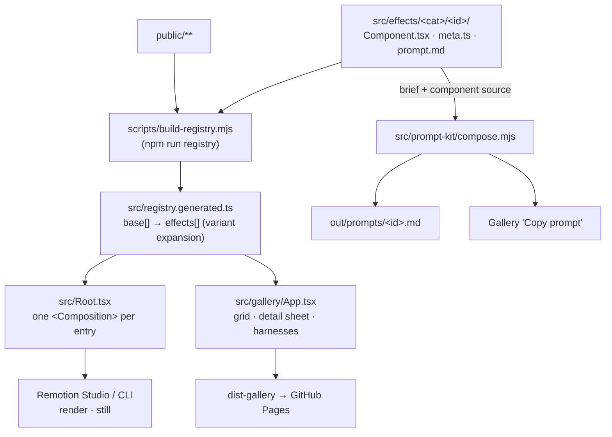
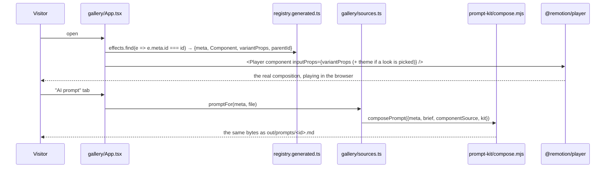

# Architecture

What this repository is, what it is made of, and why it is shaped this way.

---

## 1. What the project is

A browsable catalogue of production-ready motion for [Remotion](https://remotion.dev) **4.0.522**.

It is **not** an npm package and not a component library. Nothing here is meant to be imported. Each
effect is a single self-contained `.tsx` file that a user copies into their own project, plus the
prompt that lets a coding agent rebuild it from nothing. The repository exists to keep those two
artefacts — and a live preview of the thing they produce — provably in sync.

| | |
|---|---|
| Effect folders | **96** |
| Remotion compositions | **185** (96 base + 89 variant rows: `viz-gallery` 86, `handheld-drift` 3) |
| Categories | **16** (`src/gallery/categories.ts`) |
| Live gallery | https://vivmagarwal.github.io/remotion-effects-library/ |

Every effect is three files in one folder, and the gates exist to stop them drifting apart:

```
src/effects/<category>/<id>/
├── <Component>.tsx   the effect — one file, no local imports, typed optional props
├── meta.ts           typed metadata (EffectMeta in src/types.ts)
└── prompt.md         the effect brief — the human-written half of the AI prompt
```

### The three ways it is consumed

| Mode | Surface | Entry point |
|---|---|---|
| Copy the code | Gallery → **Source** tab → *Copy source* | `src/gallery/sources.ts` reads the real file via `import.meta.glob` |
| Copy the prompt | Gallery → **AI prompt** tab → *Copy full prompt* | `src/prompt-kit/compose.mjs` composes brief + kit + generated props table |
| Read it as reference | Gallery → **About** tab, and this `docs/` folder | `meta.description`, `meta.concepts` |

### Four rules everything else follows from

1. **One file per effect.** A component may not import a shared helper, a tokens module, or another
   effect. Duplication between effects is deliberate — see [§5](#5-core-decisions-and-why).
2. **Every moving value is a function of `useCurrentFrame()`.** No wall-clock, no CSS animation, no
   `Math.random()`. Remotion renders frames out of order and in parallel.
3. **The theme is a prop with an inline default**, never an import — see
   [DESIGN_SYSTEM.md](DESIGN_SYSTEM.md).
4. **Anything two places could disagree about gets a gate.** Taxonomy, package lists, prompt
   composition, theme defaults, asset manifest — see [QUALITY_GATES_GUIDE.md](QUALITY_GATES_GUIDE.md).

---

## 2. Module map

| Path | Responsibility | Guide |
|---|---|---|
| `src/types.ts` | `EffectMeta`, `EffectEntry`, `Category`, `Difficulty` — the contract every effect implements | [EFFECT_AUTHORING_GUIDE.md](EFFECT_AUTHORING_GUIDE.md) |
| `src/tags.ts` | Closed vocabularies `TAGS` and `CONCEPTS` | [EFFECT_AUTHORING_GUIDE.md](EFFECT_AUTHORING_GUIDE.md#6-vocabularies) |
| `src/theme.ts` | The `Theme` type, `HOUSE`, the five shipped themes, `themeFor()` | [DESIGN_SYSTEM.md](DESIGN_SYSTEM.md) |
| `src/effects/**` | The 96 effects | [EFFECT_AUTHORING_GUIDE.md](EFFECT_AUTHORING_GUIDE.md) |
| `src/registry.generated.ts` | Codegen: static imports of every effect, variant expansion, `publicAssets` | [§3](#3-how-an-effect-reaches-each-surface) |
| `src/Root.tsx` | Registers every composition for Remotion Studio and the CLI | [§3](#3-how-an-effect-reaches-each-surface) |
| `src/index.ts` | Remotion entry point (`registerRoot`) | — |
| `src/gallery/**` | The Vite catalogue app (grid, detail sheet, smoke-test harnesses) | [GALLERY_GUIDE.md](GALLERY_GUIDE.md) |
| `src/prompt-kit/**` | Shared prompt modules and `compose.mjs`, the single prompt composer | [PROMPT_KIT_GUIDE.md](PROMPT_KIT_GUIDE.md) |
| `scripts/**` | Codegen, prompt emission, and every quality gate | [QUALITY_GATES_GUIDE.md](QUALITY_GATES_GUIDE.md) |
| `scripts/lib/**` | Shared helpers for the scripts (effect walk, meta parsing, taxonomy mirror, PNG stats) | [QUALITY_GATES_GUIDE.md](QUALITY_GATES_GUIDE.md#5-shared-helpers) |
| `public/**` | Footage, audio, transcripts, SVG plates, and `ASSETS.md` provenance | [MEDIA_ASSETS_GUIDE.md](MEDIA_ASSETS_GUIDE.md) |
| `.github/workflows/**` | `ci.yml` (gates) and `pages.yml` (gallery deploy) | [DEPLOYMENT_GUIDE.md](DEPLOYMENT_GUIDE.md) |

The `diagrams` category has its own subsystem (edododraw, a generated variant list, a frame-driven
SVG renderer): [DIAGRAMS_VIZ_GUIDE.md](DIAGRAMS_VIZ_GUIDE.md).

---

## 3. How an effect reaches each surface



**The registry is generated, the expansion is not.** `build-registry.mjs` writes one static import
pair per effect folder plus the `publicAssets` list. Variant expansion happens at runtime inside
`registry.generated.ts` (`base.flatMap(...)`), because `meta.variants` is already typed source the
compiler checks — duplicating it into generated code would give it a second place to be wrong.

A variant entry inherits its parent's meta and may override only `name`, `tagline`, `checkFrame`,
`posterFrame`; its id is `` `${parentId}--${variantId}` ``, it carries `parentId`, and its `props`
become the composition's `defaultProps`.

### Surface details

| Surface | How it starts | Notes |
|---|---|---|
| Remotion Studio | `npm run studio` (`registry` then `remotion studio`) | Compositions are grouped into `<Folder>`s by category. `REMOTION_THEME=<name>` themes the whole library; an unknown name throws at startup. |
| Remotion CLI | `npm run render <id>` / `npm run still <id>` | `remotion.config.ts` sets JPEG as the frame format for video renders, overwrite on, the `angle` GL renderer, and entry `./src/index.ts`. |
| Gallery (dev) | `npm run gallery` → `localhost:5177` | Vite, React 19, `@remotion/player`. |
| Gallery (build) | `npm run build:gallery` → `dist-gallery/` | `GALLERY_BASE` sets the deploy subpath. |
| Prompts | `npm run prompts` → `out/prompts/<id>.md` | Same composer the gallery button uses; `check:compose` proves byte equality. |

---

## 4. Request/flow: what happens when someone opens a card



`inputProps` is not optional plumbing: a `<Player>`/`<Thumbnail>` mounted without `variantProps`
renders the component defaults under a variant's name — 85 cards once shipped that way, which is why
`check:gallery-variants` exists.

---

## 5. Core decisions, and why

| Decision | Why |
|---|---|
| **One self-contained file per effect; no shared helpers** | The artefact users copy is the file. A shared helper makes it unpasteable, and makes the prompt a lie. Duplication is the price and it is paid deliberately. |
| **Theme is a prop with an inline default, not an import or context** | A brief is handed to an agent with an empty directory. TypeScript's structural typing lets each file declare only the tokens it uses; `check:theme` enforces that the names, types and inline default values match `src/theme.ts`. |
| **Closed tag/concept vocabularies** | The library once had 373 tags across 88 effects, 251 used exactly once. An index where two thirds of terms appear once indexes nothing. `check:vocab` closes the list. |
| **Taxonomy in three places, gated** | `src/types.ts` (union), `src/gallery/categories.ts` (labels + order), `scripts/lib/taxonomy.mjs` (Node mirror, since Node cannot import `.ts`). `check:taxonomy` fails if they drift. |
| **Variants instead of folders** | Families — 86 diagram templates, 3 handheld presets — would otherwise be 89 near-identical folders, or one card hiding 88 looks. |
| **One prompt composer, two callers** | The gallery once had its own fork that shipped a weaker prompt than the gated one (no props table, stale setup block, wrong check frame). `check:compose` now fails on a single byte of difference. |
| **Prompts are validated by blind agents** | Each prompt is handed to a fresh agent with no memory of this project, which rebuilds the effect in an empty directory and reports every ambiguity. Defects found this way are recorded in the README. |
| **Browser gates as well as `renderStill` gates** | Two bugs shipped that were only wrong outside `renderStill` (a viewBox measured in the wrong space; `<Player>` without `inputProps`). `check:browser` and `check:player` render the gallery's own path. See [QUALITY_GATES_GUIDE.md](QUALITY_GATES_GUIDE.md#renderstill-is-not-the-viewers-path). |
| **Real footage, audio and transcripts committed** | You cannot demonstrate a silence cut on clean footage. Everything is NASA material or synthesised, provenance recorded in `public/ASSETS.md`, and no gate calls an API. |

---

## 6. Where state lives

There is no database, no server and no runtime API. Everything is files:

| Kind | Location | Written by |
|---|---|---|
| Source of truth for an effect | `src/effects/<category>/<id>/` | humans (or an agent following the brief) |
| Generated registry | `src/registry.generated.ts` | `npm run registry` — **committed**, do not edit |
| Generated viz variants | `src/effects/diagrams/viz-gallery/variants.generated.ts` | `npm run viz:variants` — **committed** |
| Composed prompts | `out/prompts/<id>.md` | `npm run prompts` — **gitignored** |
| Gate artefacts (stills, posters, browser shots, reports) | `out/**` | the gates — **gitignored** |
| Gallery build | `dist-gallery/` | `npm run build:gallery` — **gitignored** |
| Browser state | `localStorage` keys `rel-theme` (light/dark UI) and `rel-tab` (last detail tab) | the gallery app |

---

## 7. Related documents

- [DEVELOPMENT_STANDARDS.md](DEVELOPMENT_STANDARDS.md) — setup, conventions, how to add things
- [EFFECT_AUTHORING_GUIDE.md](EFFECT_AUTHORING_GUIDE.md) — the effect contract in full
- [DESIGN_SYSTEM.md](DESIGN_SYSTEM.md) — theme tokens and house style
- [PROMPT_KIT_GUIDE.md](PROMPT_KIT_GUIDE.md) — how a prompt is composed and validated
- [GALLERY_GUIDE.md](GALLERY_GUIDE.md) — the Vite app and its routes
- [QUALITY_GATES_GUIDE.md](QUALITY_GATES_GUIDE.md) — every gate and what it catches
- [MEDIA_ASSETS_GUIDE.md](MEDIA_ASSETS_GUIDE.md) — `public/`, provenance, regeneration
- [DIAGRAMS_VIZ_GUIDE.md](DIAGRAMS_VIZ_GUIDE.md) — edododraw and the viz gallery
- [DEPLOYMENT_GUIDE.md](DEPLOYMENT_GUIDE.md) — CI, Pages, rollback
