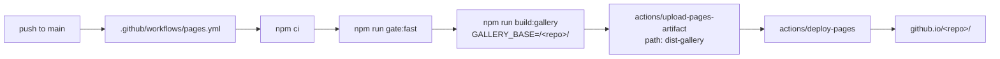

# Deployment guide

The only deployed artefact is the gallery: a static Vite build published to GitHub Pages.

Live: **https://vivmagarwal.github.io/remotion-effects-library/**

---

## 1. Pipeline



`gate:fast` runs **before** the build. A gallery that ships a prompt the gate would have rejected is
worse than a gallery that did not ship, because the whole promise of the Copy-prompt button is that
what you copy is what was validated.

Concurrency group `pages`, `cancel-in-progress: false` — deploys queue rather than cancel each other.

### Requirements

- Repository → Settings → Pages → **Source: GitHub Actions**.
- Workflow permissions: `contents: read`, `pages: write`, `id-token: write` (already declared).
- No secrets. Nothing in the build calls an external service.

---

## 2. Environment variables

| Name | Used by | Purpose |
|---|---|---|
| `GALLERY_BASE` | `vite.config.ts`, and through `import.meta.env.BASE_URL` in `src/gallery/main.tsx` | The deploy subpath. A **project** Pages site is served from `/<repo>/`, not `/`. Also remaps `staticFile()` paths so `public/` assets resolve. Default `/` — local dev unaffected |
| `REMOTION_THEME` | `src/Root.tsx` | Renders the whole library in a named theme (`house`, `broadsheet`, `console`, `studio`, `edodo`). An unknown name throws at startup rather than falling back |
| `FOOTAGE_CACHE` | `scripts/fetch-footage.sh` | Where source downloads are cached (default `out/footage-src`) |
| `DEEPGRAM_API_KEY` | `scripts/fetch-footage.sh --transcribe` | Read from the gitignored `.env`. Never needed to use or build the repository |

---

## 3. CI

| Workflow | Job | Trigger | Steps |
|---|---|---|---|
| `ci.yml` | `fast` | push to `main`, every PR, manual | `npm ci` → `npm run gate:fast` |
| `ci.yml` | `slow` | **manual only** — Actions → CI → Run workflow | `npm ci` → `npx remotion browser ensure` → `npm run gate:slow`; uploads `out/verify` + `out/poster` as the `stills` artifact (7-day retention). 60-minute timeout |
| `pages.yml` | `build` + `deploy` | push to `main`, manual | see §1 |

Both use Node 22 with npm caching. `gate:slow` is manual because it bundles the whole library and
renders ~185 stills plus two browser passes.

---

## 4. Releasing a change to the live gallery

```bash
npm run gate:fast
npm run gate:slow            # or trigger the manual CI job
git push origin main         # pages.yml redeploys
gh run watch <run-id>        # optional
```

Then **look at the live site**, not only at local renders — the deployed build is the only place a
production-only failure (tree-shaking, a stale dependency, a base-path 404) can appear. For diagram
work, sweep every card: [DIAGRAMS_VIZ_GUIDE.md §5](DIAGRAMS_VIZ_GUIDE.md#5-verifying-a-change).

### Verifying what actually shipped

```bash
curl -s https://vivmagarwal.github.io/remotion-effects-library/ | grep -o 'assets/[^"]*\.js' | head
# then grep the fetched bundle for a token you just changed
```

---

## 5. Rollback

The Pages deployment is a build artefact of a commit, so rolling back is rolling back the commit:

```bash
git revert <bad-commit> && git push origin main      # preferred — redeploys on push
```

Or re-run the last good `Deploy gallery to Pages` run from the Actions tab (Re-run all jobs), which
rebuilds that commit's tree and redeploys it. There is no separate deploy state to unwind — no server,
no database, no cache to purge beyond the CDN's own.

---

## 6. Consuming the library elsewhere

There is nothing to install. An effect ships by being copied: the file, or the prompt that rebuilds it.
Anyone running this code needs their own Remotion licence — Remotion is free for individuals,
non-profits and companies with up to 3 employees, and paid above that
([remotion.dev/license](https://www.remotion.dev/license)).
