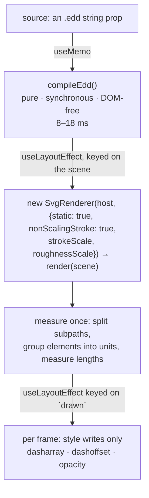

# Diagrams and the viz gallery

The `diagrams` category, [edododraw](https://www.npmjs.com/package/edododraw), and `viz-gallery` — the
one effect that ships as 87 compositions.

edododraw is **first-party**: it is developed in a sibling repository (`~/Work/edodo-draw`) and
published to npm by its own release script. When a diagram reads wrong, fixing the template upstream
and republishing is usually the right move, not working around it here.

---

## 1. What is where

| | |
|---|---|
| Effects in the category | 9 — `attention-indicators`, `bullet-pop-list`, `checklist-ticks`, `hand-annotations`, `logo-path-draw`, `shape-morph`, `step-progress`, `viz-gallery`, `write-on-text` |
| Effects that use edododraw | **1** — `viz-gallery` (the others are hand-written SVG, `@remotion/paths` or `@remotion/rough-notation`) |
| Compositions from `viz-gallery` | **87** — the base card plus 86 generated variants |
| Pinned version | `edododraw ^0.16.2` |
| Prompt module | `src/prompt-kit/diagrams.md` (selected when `meta.packages` includes `edododraw`) |

Install it with `npm i edododraw --omit=optional`. Its optional dependency
`@excalidraw/mermaid-to-excalidraw` pulls mermaid → d3 → cytoscape → katex: **122 packages / 66 MB**
versus **8 packages / 4.2 MB** without it. The composer adds the flag automatically
(`INSTALL_FLAGS` in `compose.mjs`).

---

## 2. The frame-driven contract

`src/effects/diagrams/viz-gallery/VizGallery.tsx` is the reference implementation, and the contract is
the lesson:



- **Compile once.** `compileEdd()` is pure and synchronous, so it runs in a `useMemo`. Rough-sketch
  seeds are hashed from element ids, not random, so the same source always draws the same picture.
- **Render once.** `renderer.render(scene)` touches the DOM, so it runs in a `useLayoutEffect` keyed on
  the scene — never per frame.
- **Per frame, write styles only** on elements measured at mount. The result must be a **total function
  of the frame**: Remotion renders frames out of order and in parallel, so anything that accumulates
  gives a different answer depending on which frame a worker drew first. That is why finished strokes
  are re-written every frame instead of skipped.
- **`static: true`** strips every CSS transition and the animated-arrow keyframe overlay; without it a
  worker can screenshot a 0.45 s transition mid-flight and two renders of the same frame disagree.

### The details that make it read as drawing

| Detail | Why |
|---|---|
| **Dash lengths are measured in screen pixels** — `getTotalLength() × √\|det(CTM)\|` when `vector-effect: non-scaling-stroke` | A non-scaling stroke dashes in the SVG viewport's pixels. Measured in user units, a diagram fitted at 2× closes every circle halfway round — on the finished frame, not just mid-draw |
| **Stroke-only paths are split per subpath at mount** | A dash pattern restarts at each subpath, and rough.js writes each side of a box as its own `M … C`. Un-split, a box grows from all four corners at once and a curve appears as scattered ticks |
| **The unit is the data ITEM, not the element** | edododraw renders by z-layer: a sweep in document order draws the whole skeleton empty and pops every word in at the end. Elements carry `data-viz-item`, so an item's box, connector, icon and label draw together. Units are ordered by `scene.nodes` (emission order = reading order); the title is rank −1 and draws first; an edge draws just before the node it points at |
| **Outline at full strength, fill fading behind it** | Fading the whole group makes a tinted shape arrive as a pale disc ahead of its own line. Fills fade over `(q − 0.25) / 0.5` of the part's share |
| **Labels wait until their outline is 70 % drawn** | A label arriving with the first pixel of its box reads as a screenshot; one arriving after everything reads as a typo fix |
| **Authored opacity is multiplied, never overwritten** | A heatmap cell's intensity or a radar series at 60 % would otherwise end up opaque on the last frame |
| **A stroke that carries its own dash pattern fades instead of drawing** | Drawing it by dasharray would replace its dashes with one solid line that snaps back to dotted at the end |
| **A finished stroke's dasharray is cleared** | Leaving `dasharray = len` is only correct while `len` is exact, and the finished frame is what posters, thumbnails and every viewer's last look catch |

### Camera and weight

```ts
const viewport = {w: width, h: height - HOST_TOP - HOST_BOTTOM};
const camera = cameraForBBox(sceneBBox(scene), viewport, {padX: padding, padY: Math.round(padding * 0.46), maxZoom});
new SvgRenderer(host, {static: true, nonScalingStroke: true,
  strokeScale: (theme.stroke / 2) * (height / 1080),
  roughnessScale: Math.min(1, 1 / camera.zoom)});
renderer.setViewport(viewport);   // load-bearing — see below
renderer.applyCamera(camera);
```

- **`setViewport()` is not optional.** The renderer's own `measure()` reads `clientWidth`/`clientHeight`,
  and Remotion mounts a composition inside a 0×0 wrapper during the layout pass, so a `useLayoutEffect`
  sees 0×0 and the camera degenerates. An earlier version "worked" only because that degenerate camera
  made the wrong-space `viewBox` framing accidentally correct in `renderStill` — and every browser drew
  all 82 cards off their own viewBox.
- **Padding is asymmetric** (`padY = 0.46 × padX`): 80 of the 87 templates fit height-first, so equal
  padding spends the scarce axis on margin and shrinks the type by ~15 %.
- **`maxZoom` (default 1.8) caps the fit**, so a small diagram keeps its air instead of rendering its
  26-unit title at 65 px next to another card's 21 px.
- **`roughnessScale = min(1, 1/zoom)`** puts rough.js's jitter back into screen units — it perturbs
  geometry in world units, so the fit magnifies the sketchiness along with everything else. It is never
  raised above 1: a diagram fitted *down* may read calmer, never rougher.
- **`strokeScale`** turns `theme.stroke` (a weight at 1920×1080) into a screen weight, applied to every
  stroked mark so connectors do not stay hairlines beside thickened boxes.

### How the theme reaches a diagram

`themedPreset(base, theme, roughness)` registers a **copy** of the edododraw style preset carrying the
theme's `paperSeries` palette, paper ink, muted ink, edge, background, emphasis, the `hand` typeface
(for body, heading and title),
corner radius (scaled by `theme.radius / HOUSE.radius`) and roughness, under a name hashed from those
values. A source that declares its own `meta` block keeps its own style — like any explicit prop, it
wins over the theme.

---

## 3. The generated variants

`npm run viz:variants` writes `src/effects/diagrams/viz-gallery/variants.generated.ts` from
`edododraw/demos`' `VIZ_DEMOS` — the curated, runnable demo the package ships for each template. It is
generated because the catalogue lives upstream: a template added in a future release appears here on
the next version bump with no one noticing.

Exports: `VIZ_VARIANTS` (86 rows), `VIZ_TEMPLATE_COUNT`, `VIZ_EXCLUDED`, `VIZ_CATEGORIES`.
`meta.ts` reads them; **the component does not** — it inlines its own default diagram, because
`./variants.generated` is a relative import and the component's whole contract is that it runs in a
project that has never heard of this repository.

`EXCLUDED` currently holds one template, `tug-of-war`: its two teams pull a rope the character figures'
hands do not reach. The exclusion count and reason are printed into the generated file so it cannot
look like a bug.

---

## 4. `check:edd`

Fails when the installed edododraw has `sideEffects: false`, when a `sideEffects` glob matches no
shipped `.js`, when fewer than 80 templates register, or when a template used by the generated variants
compiles to an empty scene.

It exists because of a failure with **no symptom**. edododraw populates its visualization registry by
**import side effect**, and its `sideEffects` globs once pointed at `**/viz/generators/*.ts` while the
published build ships only `.d.ts` files there. The declaration matched nothing, the package looked
side-effect-free, and a production bundler tree-shook the registrations away. An unregistered viz type
*warns rather than errors*, so cards compiled to zero-node scenes and rendered clean blank frames. Every
gate was green; the dev server was fine; server-side stills were fine; only the production Vite build
tree-shook.

---

## 5. Verifying a change

`renderStill` is **not** the path a viewer takes, and for this subsystem the difference has bitten
three times. Always finish by looking at the built gallery in a browser.

```bash
# 1. build the gallery with the version you are testing
npm run build:gallery && npx vite preview --port 4190 --strictPort &

# 2. confirm which edododraw is actually in the bundle
node -p "require('./node_modules/edododraw/package.json').version"
grep -rl "<a value you just changed>" node_modules/edododraw/dist-lib/chunks/*.js

# 3. sweep every viz card through the gallery's own player harness, mid-draw and final
#    (#/play/<id> + window.__play.showThumb(frame), screenshot each)

# 4. tile the shots into contact sheets and LOOK at them
```

Three traps, all of which have cost a full review pass:

1. **A cached bundle can hide the dependency you just changed.** Webpack treats `node_modules` as
   immutable per version, so an overlaid local build is invisible until you bundle with caching off.
   A whole "verified" pass once checked an unpublished local edododraw while the site shipped the
   published one.
2. **`npm run build` in `edodo-draw` builds the docs site, not the package.** The package is
   `npm run build:pkg` (`build:lib` + `build:types`), and `npm pack` will happily ship a stale
   `dist-lib`.
3. **Small differences hide in a thumbnail.** `check:browser`'s 0.06 threshold is calibrated for blank
   frames and gross geometry, not for a missing fill. Contact sheets and human eyes are the gate here.

## 6. Upgrading edododraw

```bash
npm install edododraw@^<version>
npm run viz:variants          # template list and demo sources come from the package
npm run gate:fast             # includes check:edd
# browser sweep + contact sheets (§5)
```

Then update the version claims, which are gated by nothing and so must be done by hand:
`src/prompt-kit/diagrams.md` (the "verified against" line and the floor) and the README's diagrams
section. The viz-gallery brief's `**Setup**` line is rewritten from `meta.packages` at compose time, so
a version written there never reaches a prompt — keep it in step anyway, for readers of the file.
