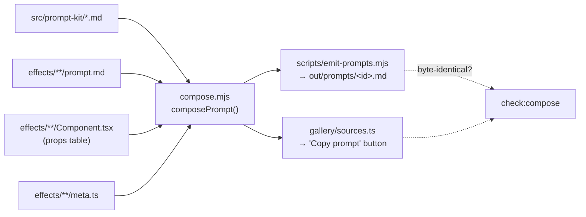

# Prompt kit guide

How a prompt is composed, what is in it, and how it is proved correct.

The prompt is a first-class artefact of this repository, not documentation about one. A user hands it
to a coding agent with **no Remotion skills installed and no memory of this project**, and expects the
effect back.

---

## 1. Anatomy of a composed prompt

`composePrompt()` in `src/prompt-kit/compose.mjs` emits, in this exact order:

| # | Section | Source |
|---|---|---|
| 1 | `# <name> — Remotion` + the brief | `src/effects/<cat>/<id>/prompt.md`, with its `**Setup**` bash block **rewritten** from `meta.packages` |
| 2 | Project setup | `src/prompt-kit/project-setup.md` |
| 3 | "Packages this effect needs (the complete list)" | generated by `installLine(meta.packages)` |
| 4 | Props and defaults table | **generated from the component source** |
| 5 | House style | `src/prompt-kit/house-style.md` |
| 6 | The theme | `src/prompt-kit/theme.md` |
| 7 | Remotion core | `src/prompt-kit/core.md` |
| 8 | Opt-in modules, in `MODULE_RULES` order | see [§3](#3-module-selection) |
| 9 | Definition of done | generated: composition id, dimensions, fps, duration, the exact `remotion still` command at `meta.checkFrame`, and the frame-driven rule |

`installLine()` splits the install into `npx remotion add …` for `@remotion/*`, `npm i …` for the rest,
a separate line per package that needs a flag (`edododraw --omit=optional`), and `npm i -D @types/…`
for packages that ship no types (`three`, `topojson-client`, anything `d3-*`).

---

## 2. One composer, two callers



`compose.mjs` is plain ESM on purpose — no TypeScript, no `node:fs`, no `import.meta.glob`. The caller
supplies every string, so the same module runs under Node and under Vite, and everything in it is pure.

Node loads the kit from disk (`scripts/lib/kit.mjs`); the gallery loads it with
`import.meta.glob('../prompt-kit/*.md', {query: '?raw', eager: true})`. Both feed the same
`buildKit()`.

**Why this matters:** the gallery once had its own forked composer, and it was strictly the worse one —
no props table, un-synced setup blocks (21 of 28 had drifted), no `@types/*` line, and a check frame of
`round(durationInFrames * 0.6)` instead of `meta.checkFrame` (wrong for 87 of 88 effects). The gated
prompt and the copied prompt were different documents. `check:compose` now fails on a single byte of
difference and on any re-implementation of `installLine`/`propsTable`/`syncSetupBlock` inside
`sources.ts`.

---

## 3. Module selection

Always included: `project-setup.md`, `house-style.md`, `theme.md`, `core.md`.

Opt-in, in this order (`MODULE_RULES` in `compose.mjs`):

| Module | Included when |
|---|---|
| `video.md` | `meta.requires` includes `'video'` |
| `captions.md` | `meta.requires` includes `'transcript'` |
| `audio.md` | `meta.requires` includes `'audio'` |
| `three.md` | `meta.packages` includes `'@remotion/three'` |
| `d3.md` | any package starts with `d3-` |
| `diagrams.md` | `meta.packages` includes `'edododraw'` |
| `shaders.md` | the effect uses `createEffect`, `@remotion/effects` or `@remotion/transitions` |

An effect that never imports three.js no longer receives 3 KB of three.js advice. `@remotion/transitions`
selects the shader module because half its presentations are shader-based and render blank without
`--gl=angle` — that warning lives in `shaders.md` §4.

---

## 4. The public API of `compose.mjs`

| Export | Purpose |
|---|---|
| `composePrompt({meta, brief, componentSource, kit})` | The whole document |
| `installLine(packages)` | The exact shell block that installs `meta.packages` |
| `syncSetupBlock(brief, packages)` | Rewrites the brief's `**Setup**` fence from the metadata |
| `readPropsFromSource(tsx)` / `propsTable(props)` | Scan `export const X: React.FC<Props> = ({…})` and render the table |
| `declaresProps(tsx)` | Whether the file has a `type Props` at all |
| `selectModules({meta, componentSource, kit})` | `{included, missing}` per `MODULE_RULES` |
| `buildKit(files)` | `{filename: contents}` → the kit object |
| `moduleText(modules, key)`, `splitTopLevel(block)`, `KIT_FILES`, `MODULE_KEYS`, `MODULE_RULES`, `PROPS_BLOCK_RE` | Supporting pieces the gates also use |

`splitTopLevel()` exists because defaults contain arrays, objects and strings with commas in them
(`'Rendering, everywhere'`), so the props scan tracks quotes and nesting rather than splitting on `,`.

---

## 5. Writing a brief

See [EFFECT_AUTHORING_GUIDE.md §4](EFFECT_AUTHORING_GUIDE.md#4-promptmd--the-brief). The two rules the
gates enforce:

- **Self-contained.** `check:standalone` fails on "this repo", "the library", "as elsewhere",
  "see also", "as above in", on a `staticFile()` path that is not in `public/`, and on a declared
  size/fps/frame count that disagrees with `meta.ts`.
- **Truthful about packages.** The `**Setup**` block is rewritten from `meta.packages`, and
  `check:imports` fails if the component imports something the install line does not cover, or
  `meta.packages` lists something never imported.

---

## 6. Editing a kit module

`src/prompt-kit/*.md` ships inside every prompt that selects it, so an edit reaches ~96 documents.

```bash
npm run prompts        # rewrite out/prompts/*.md  (do this FIRST — check:compose diffs against them)
npm run check:compose
npm run gate:fast
```

Rules of thumb:

- The modules are read by agents, not people: state the rule, then the failure it prevents.
- Keep them internally consistent. A blind-agent round once found four self-contradictions in the
  shared essentials block alone (a 44 px type floor every chart label breaks; a `loadFont` example
  planting the bug the next paragraph warns about; "no magic frame numbers" against briefs written in
  frame numbers; "construct stateful objects inside the render" against `loadFont` at module scope).
- Version claims must be checked against the installed package, not remembered.
  `diagrams.md` names the exact `edododraw` version it was verified against.

---

## 7. How prompts are validated

1. **`check:prompts`** — every scalar prop default in the component must appear in the prompt. Before
   the generated table existed, 65 of 88 prompts were missing at least one, and blind agents reported
   the same defect every round.
2. **`check:compose`** — the button and the gate ship the same bytes.
3. **`check:standalone`, `check:imports`, `check:media-props`** — no repo references, honest install
   lines, no `objectFit` in a `style` even inside a brief's code fence.
4. **The blind-agent round** — hand `out/prompts/<id>.md` to a fresh agent with an empty directory. It
   builds, renders, and reports every ambiguity and false claim. This is the only check that finds
   *missing* information; everything else can only find contradictions.

Defects found this way — including ones in the components themselves, such as a chart whose first frame
was pure black and a simulation that ran out of ticks and left 51 byte-identical frames — are recorded
in the README's *How prompts are validated* section.
