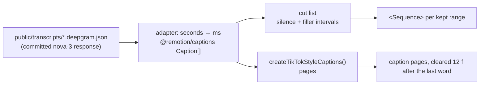

# Video editing guide

The `edit`, `grade`, `captions` and `sound` categories — what they demonstrate, and the API facts that
are easy to get wrong.

Most Remotion libraries animate rectangles. This one also cuts video: the primitives are all in
4.0.522 already, and the only missing ingredient was footage
([MEDIA_ASSETS_GUIDE.md](MEDIA_ASSETS_GUIDE.md)).

The authoritative, agent-facing versions of everything below are the prompt-kit modules
`src/prompt-kit/video.md` (468 lines), `captions.md` (280) and `audio.md` (182). They ship inside every
prompt that needs them. This page is the orientation; those files are the reference.

---

## 1. The effects

| Category | Effects |
|---|---|
| `edit` (9) | before-after-wipe · designed-pause · freeze-trail · handheld-drift · ken-burns · photo-stack-shuffle · punch-in-cut · silence-cut · speed-ramp |
| `grade` (2) | film-grade · progressive-blur-focus |
| `captions` (3) | pause-aware-captions · subtitle-band · tiktok-captions |
| `sound` (3) | audiogram · fft-bars · music-duck |

They are thin compositions over `<Video>`/`<Audio>` from `@remotion/media` plus a wrapper. Almost none
of it is new API — it is the API used deliberately.

---

## 2. The API facts that bite

| Fact | Consequence |
|---|---|
| **`objectFit` is a PROP on `<Video>`, never a style.** It decodes into a canvas, so CSS `object-fit` has nothing to act on and is silently ignored | Invisible while source and composition share an aspect ratio; appears the day 16:9 footage goes in a 9:16 frame. `check:media-props` fails on it, in a component **and** in a brief's code fence |
| **Crop props are 0–1 ratios and clip, they do not rescale.** `cropLeft/Right/Top/Bottom`, inherited from `Sequence`, clamped, collapsing to `[0.5, 0.5]` if an opposite pair sums over 1, implemented as a `clip-path`; they throw with `layout="none"` | A 16:9 → 9:16 reframe is crop **plus** scale and translate. Crop alone is a letterbox |
| **`playbackRate` is read once at mount** | A speed ramp is a *remap*: sum the speed so far to get the source position and seek there with `trimBefore`, inside `<Sequence from={frame}>` so the child's clock cannot advance too. It pitches audio with the picture, and `toneFrequency`'s verified range (0.01–2) cannot correct a 0.4× ramp — so mute the picture and run a separate un-ramped `<Audio>` |
| **`volume={(f) => …}` gets a scene-local frame** — it restarts at 0 when the audio starts and is not `useCurrentFrame()` | Build the speaking mask from the **utterance** list, not per word, or the bed pumps |
| **`@remotion/effects` needs `Config.setChromiumOpenGlRenderer('angle')`** (already in `remotion.config.ts`) | Without it, WebGL effects — `colorCorrection`, `colorKey`, `regionBlur`, `zoomBlur` and the rest of the 71 subpath exports — render **black with no error** |
| **Alpha overlays: ProRes 4444 first** (`--codec=prores --prores-profile=4444`) | It is the only alpha that survives re-import into Remotion or compositing by ffmpeg. VP8/VP9 WebM alpha comes back as an opaque black box; keep `--codec=vp8` for web `<video>` playback only |
| **Freeze frames** use `<Sequence freeze={n}>` | No wrapper needed |

Punch-in vocabulary, for reference: an invisible jump-cut punch is a hard cut 1.00 → 1.04 over **0
frames**, alternating levels, never repeating a level twice in a row; an emphasis punch is 1.00 → 1.12
over 6–8 frames landing the *end* of the move on the stressed syllable; a creep is ~1.2 %/s, **linear**,
direction alternating shot to shot.

---

## 3. The transcript-driven workflow

Deepgram word timings → cut list → captions → pauses. Every step is data, so the whole edit is a JSON
file you can inspect and diff.

**Convert once, at the boundary.** Deepgram times are **seconds** (floats); `@remotion/captions`'
`Caption` is `{text, startMs, endMs, timestampMs, confidence}` — **milliseconds**.

### Cut-list thresholds (these are the numbers, not a starting point)

| | |
|---|---|
| Silence threshold | **4 % of peak RMS** over a 20 ms window |
| Minimum silence to cut | **350 ms** |
| Keep margin | **180–220 ms each side**, so the cut never clips a consonant onset |
| Minimum kept segment | **250 ms** |
| Merge after filler removal | adjacent kept ranges whose gap is now **< 120 ms** |
| Fillers | **disfluencies only** — `um, uh, umm, uhh, uhm, hmm, er, ah`. Each is cut as its **own interval, ±50 ms**, independent of the silence gate |
| Discourse markers | `like, you know, so, basically, actually, I mean, right` — **review-only**, never auto-cut: removing them changes the meaning |

**Why fillers get their own interval:** dropping a filler from the word list is not a cut. Whenever its
neighbours sit closer than the silence threshold, the run is kept whole and the "um" stays in the
picture — which is exactly what three of the five real `um`s in `interview-raw.mp4` did until it was
measured.

**Two gap regimes.** Short-form tightens every gap (~40 % of a talking head removed). The conservative
regime, validated on an 88-minute cut, touches only gaps **> 0.9 s** and only down to **0.8 s**, and
leaves thinking pauses under 1.1 s alone. Pick by format and say which in the brief.

Two rules override the table: never cut a sentence-final gap below **250 ms**, and never cut the gap
immediately before an emphasis word — that pause *is* the emphasis. And never cut *on* a word: a cut
frame must land inside a gap, and if the gap is under 6 frames, move to the next one that is not.

### Captions

`createTikTokStyleCaptions({captions, combineTokensWithinMilliseconds, breakOnSilenceAfterMilliseconds})`.
That last option is the hook for deliberate pauses: a gap in the word timings *is* the pause, and it
becomes a page break rather than a run-on caption.

A karaoke page appears exactly on the frame its first word starts and each word lights on its own
onset — never earlier. A subtitle *line* may lead its audio by 0.2–0.5 s; a highlighted *word* may not.
The last page clears **12 frames** after its final word ends.

### Designed pauses

Real speech gaps are 0.15–0.5 s, so a 1–5 s pause at a transition is always a synthesised insert, never
a found silence — which means it has to be decided. The full 10-step schedule (base by topic level,
beat and importance modifiers, energy modifier, clamp to `[8, 150]`, `inHold = clamp(round(outHold ×
0.6), 6, 60)`, transition choice by hold length, room-tone rules, caption clearing) is in
`src/prompt-kit/captions.md` and demonstrated by `designed-pause`.

**Never leave true digital silence for more than 20 frames** — it reads as a fault, not a pause. Room
tone at −32…−28 dBFS.

---

## 4. Sound

| | |
|---|---|
| Ducking | dialogue −12…−6 dBFS, bed −18…−24, duck 9–12 dB, look-ahead 250 ms–1 s, only un-duck if the gap exceeds 1.2 s, interpolate **in the dB domain**, never in linear gain |
| Master loudness | **−16 LUFS / −1.5 dBTP / LRA 11** for shorts, social and podcast; **−14 LUFS / −1 dBTP** for YouTube long-form. Two-pass `loudnorm` (measure with `print_format=json`, then apply), run **once, last, outside Remotion** — Remotion does not normalise |
| SFX timing | The transient lands **1–3 frames before** the visual event: a whoosh starts 10 f before the cut, a riser *ends* on the cut, an impact lands 1 f before, a pop 1 f before the scale starts. Never more than 3 SFX in 15 frames |
| J/L cuts | 6–12 f fast dialogue · 24–45 f interview → b-roll · 30–60 f cinematic scene change. Always equal-power (`Math.sqrt`) crossfades, never linear |
| B-roll holds | illustrative 45–75 f · establishing 90–150 f · reaction 20–36 f · insert 36–60 f · floor 18 f |

Shipped SFX lengths are listed in `src/prompt-kit/video.md` (e.g. `riser.mp3` 2.038 s ≈ 61 frames at
30 fps), because "the riser ends on the cut" is only actionable with the length.

---

## 5. Safe areas for burned text

| Platform (1080×1920) | top | bottom | left | right |
|---|---|---|---|---|
| TikTok | 130 | 484 | 44 | 140 |
| Instagram Reels | 210 | 310 | 42 | 84 |
| YouTube Shorts | 120 | 300 | 48 | 96 |
| **Universal** (clears all three) | **260** | **484** | **48** | **140** |

Captions specifically: bottom-anchor between **520 and 620 px**, which clears TikTok's caption stack
and the Reels action rail at once. Anything that must also survive the **4:5** feed crop (1080×1350, a
centre crop dropping 285 px top and bottom) stays inside **y 300–1440**. On **16:9**, a burned caption
sits **≥ 108 px** from the bottom, above YouTube's control bar.

Text over footage needs contrast ≥ 4.5:1 against the **worst** pixel across the shot, not the average —
prefer a gradient scrim, then a blur pill, then a stroke with `paintOrder: 'stroke fill'`. A drop shadow
alone is not enough.
